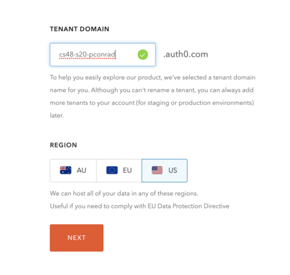
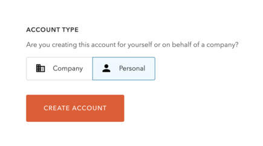
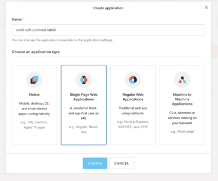
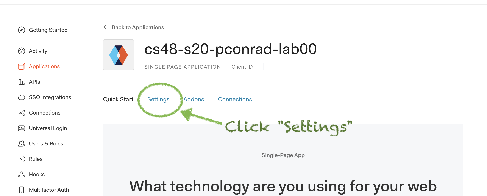
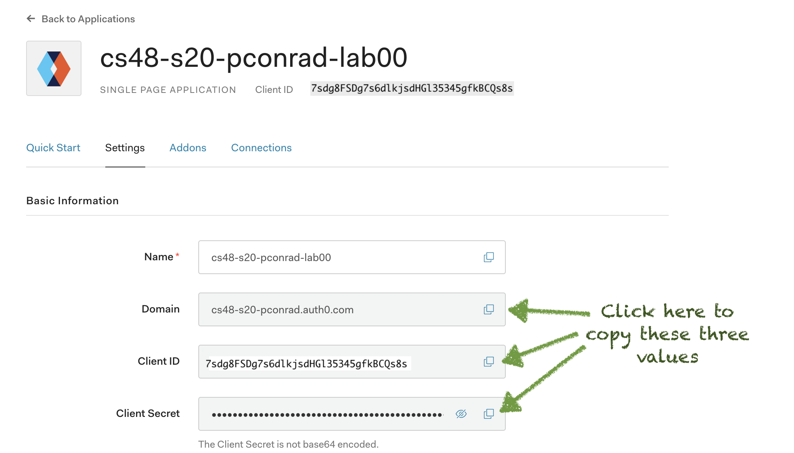
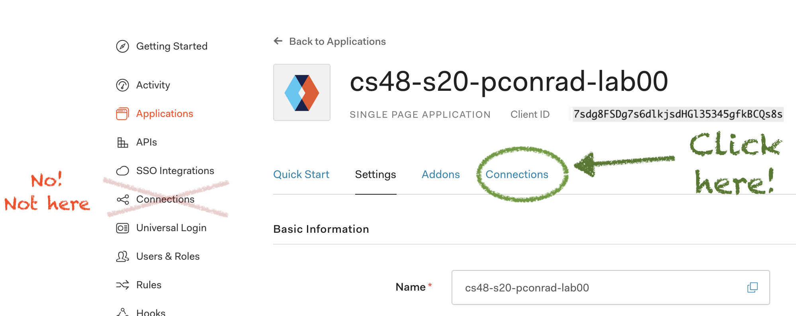
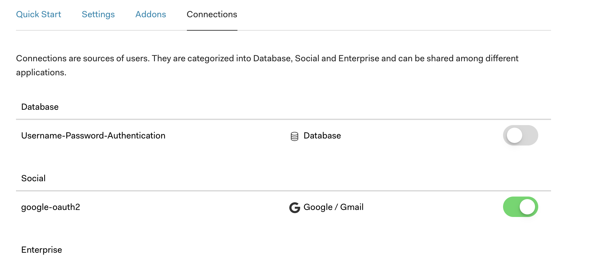

# Configuring Auth0 for localhost

To work properly, this application must be configured to use Google OAuth
using the Auth0 service.

This involves:

- Setting up an Auth0 account
- Setting up an Auth0 application
- Configuring that Auth0 application
- Obtaining values for three secrets
- Storing those values in a local file called `.env` that is
  NOT stored in the GitHub repo.

This file explains all of these steps.

# The three secrets

This app requires three configuration secrets in order to function properly. Each of these secrets has a _key_ and a _value_:

| Key                   | Sample Value (these are just fake examples)                        |
| --------------------- | ------------------------------------------------------------------ |
| `AUTH0_DOMAIN`        | `cs48-s20-pconrad.auth0.com`                                       |
| `AUTH0_CLIENT_ID`     | `7sdg8FSDg7s6dlkjsdHGl35345gfkBCQs8s`                              |
| `AUTH0_CLIENT_SECRET` | `6_BAi57vhRr3gETMV1ZYDSMQ-Tupp6uSW38XJj1lJ2d157MQXUpgaQ81d5e7bR6k` |

(A fourth secret, `SESSION_COOKIE_SECRET` is configured automatically as explained below.)

The instructions in this file explain how to obtain these secrets
and store them in the `.env` file.

We note that eventually these secrets must also be stored in two other places.

1. On GitHub in the Settings panel of the repo under `Secrets` so that
   GitHub action can successfully run the test cases for your app.

2. On `now.sh` as secrets for your deployed application. This is
   described in [docs/auth0-production.md](auth0-production.md)

These additional steps are described in [docs/auth0-github-actions.md](./auth0-github-actions.md), and [docs/auth0-production.md](./auth0-production.md), each of which is linked to from the [README.md](../README.md) at the appropriate step. You don't need to worry about that for now.

# Create the `.env` file:

The `.env` file should be created by running `cp env.SAMPLE .env`

This file is only stored in the local repo, not in the file system of the GitHub repo

The reason that we do not store the secrets in the file system
of the GitHub repo is that if the code is ever made open source
in the future, having these secrets in the code leaks them to the public.

Even if you have no plans to make your code open source, maintaining
these secrets in your source code is a poor practice. One
of the learning goals of CMPSC&nbsp;48 is to train you for real world
software development practices, so we will review your code, and make
deductions if we find secrets hard coded in files committed to GitHub.

For now, the .env file looks like this, with placeholders for the three
secrets. We'll put in the values at a later stage:

```
# Fill in the below values by following the instructions in docs/auth0.md
AUTH0_DOMAIN=
AUTH0_CLIENT_ID=
AUTH0_CLIENT_SECRET=
```

**A note to Windows Subsystem for Linux (WSL) users**: Make sure your `.env` file uses the UNIX line ending (`\n`) instead of the Windows (DOS) line ending (`\r\n`). One possible solution is here: <https://www.scivision.dev/git-line-endings-windows-cygwin-wsl/>

## Setting up Auth0 for `localhost`

First, [sign up for an account with Auth0](https://auth0.com/signup). You should only have to do this once during the course.

You will be asked to create a tenant. It doesn't matter what your tenant name is, and it's totally fine to take the default. However, we suggest that you name it: `cs48-s20-githubid` where `githubid` is your githubid, as shown here (using `pconrad` as an example):



For "Account Type", click "Personal", then "Create Account":



## Setting up Auth0 for `localhost`

### Register a New Application

Next, register a new application. You do this by navigating to the "Applications" page in the sidebar and clicking the
"Create Application" button.

Give it a name:

- We suggest the name of your repo, prefixed by `cs48-s20`
- Example: `cs48-s20-cgaucho-lab00`

Click to select "Single Page Application" as shown below:



## Configure

In the configuration for the application you just created, click on the "Settings" tab. The settings tab is the second from right in the center of the page
as shown here:



Once on the settings tab, you'll need to do two things:

1. At the top of the page, you'll see `Basic Information`
   - Under `Basic Information`, you'll see `Name`, `Domain`, `Client Id` and `Client Secret`.
   - In a moment, you'll copy the three secrets that you see here into your `.env` file. But not yet; first, scroll down until you find `Application URIs`
2. Once you've found `Application URIs`, you are ready to enter the following values:

   | Field                 | Value                                |
   | --------------------- | ------------------------------------ |
   | Application Login URI | (leave this blank)                   |
   | Allowed Callback URLs | `http://localhost:3000/api/callback` |
   | Allowed Logout URLs   | `http://localhost:3000`              |

   Make sure to scroll down to the bottom of the page and click
   "Save Changes" at the bottom of the page to save
   your changes.

3. Now, after clicking "Save Changes", scroll back to the top
   where you see the `Basic Information`.

   You should see these fields:

   

   At the right hand side of the fields
   `Domain`, `Client Id` and `Client Secret`, there is a box where you can
   click to copy the value. Copy each of these values, and place it
   in the file `.env`, after the three assignment statements, similar
   to the example below:

   ```
   AUTH0_DOMAIN=cs48-s20-pconrad.auth0.com
   AUTH0_CLIENT_ID=7sdg8FSDg7s6dlkjsdHGl35345gfkBCQs8s
   AUTH0_CLIENT_SECRET=6_BAi57vhRr3gETMV1ZYDSMQ-Tupp6uSW38XJj1lJ2d157MQXUpgaQ81d5e7bR6k
   ```

   NOTE: Do NOT put spaces before or after the = in the `.env` file.

   - ok: `AUTH0_CLIENT_ID=7sdg8FSDg7s6dlkjsdHGl35345gfkBCQs8s`
   - NOT ok: `AUTH0_CLIENT_ID = 7sdg8FSDg7s6dlkjsdHGl35345gfkBCQs8s`

4) Now find the `Connections` tab of **your app** (not the `Connections`
   item on the sidebar) and click it:

   

   Adjust and/or check these settings:

   - Uncheck Username-Password-Authentication.
   - Ensure google-oauth2 is checked (it should be by default).

   

# All done!

For developing on localhost, this is all you have to do; you should
be able to return to the instructions in [README.md](../README.md)
for starting up the application on localhost.
